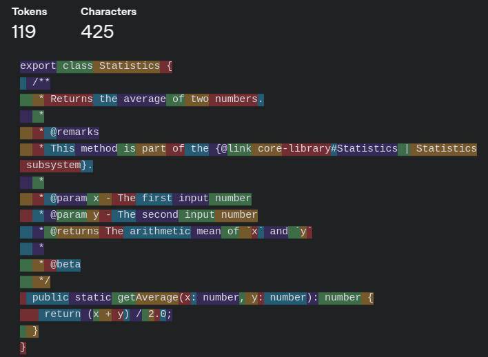
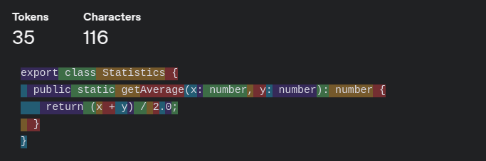
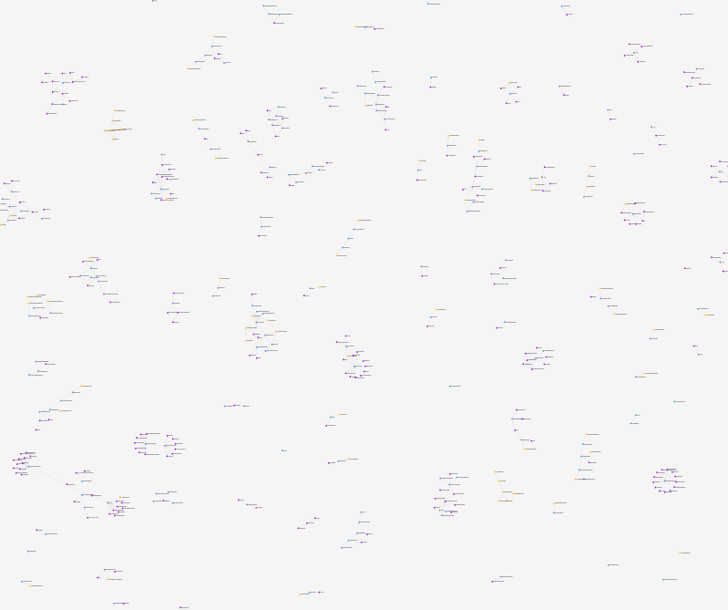
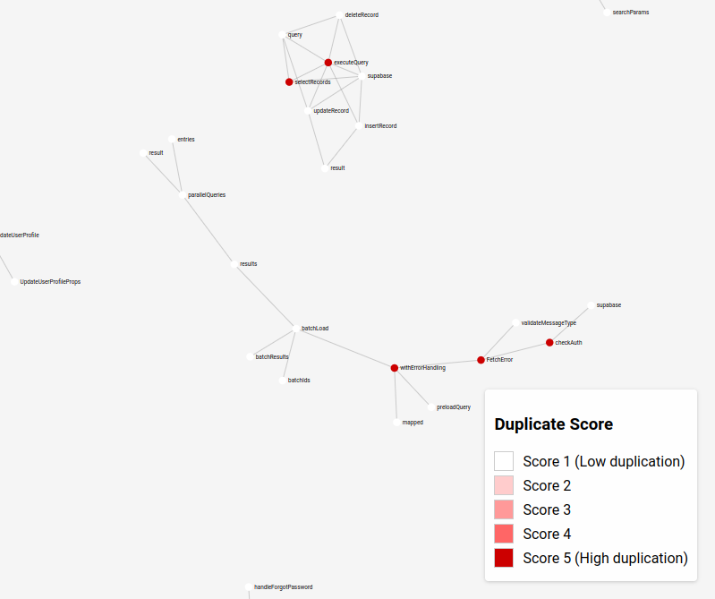

# CursorCrawl

CursorCrawl is a VSCode extension built to;
1. Solve some of the most common problems caused by AI code editors like Cursor
2. Create AI-readable documentation for AI code editors
3. Experiment with novel approaches to performing static code analysis with AI

This entire app was built in 24 hours during the GauntletAI Hackathon (8AM 2025-02-28 through 8AM 2025-03-01)

I am writing this README at ~2am, so expect spelling errors.

## Motivation
Current coding tools are made for humans. However, with the advent and continuous improvement of LLMs, and the development of tools like Cursor, Windsurf, Cline, and many others, code will be primarily written -- and read -- by AI. 

Eventually, the goal is that AI tools will be able to sense their own inputs, outputs, and code (through something like MCP) -- in which case the code itself is the documentation. However, we are still far from that point -- and openAIs recent underwhelming release of gpt-4.5 doesn't create a lot of confidence that this future is right around the corner. 

In addition, the use of AI-assisted programming tools should change the way we approach documentation. The gold standard of well-documented code for humans may actually be bad form for writing with AI. For example, if we look at this code below:

```
export class Statistics {
  /**
   * Returns the average of two numbers.
   *
   * @remarks
   * This method is part of the {@link core-library#Statistics | Statistics subsystem}.
   *
   * @param x - The first input number
   * @param y - The second input number
   * @returns The arithmetic mean of `x` and `y`
   *
   * @beta
   */
  public static getAverage(x: number, y: number): number {
    return (x + y) / 2.0;
  }
}
```
It has 119 tokens with the documentation, but only 35 tokens without. 





From a human perspective, the documentation makes it easier to understand, but from the LLMs perspective it is 3.4 times more work to read.

On the other hand, tools like Cursor are still in their infancy, and are very prone to making mistakes that can be extremely frustrating to fix. The main one I am focusing on here is code duplication.

Therefore, I think it is worth exploring methods to rethink our approach to documentation in a way that will make it easier for both the human and the AI. 

The overarching idea to my approach is that we can use LLMs to generate detailed documentation about the code in English. These documents should be separate from the code itself, as to reduce the number of tokens, but should also be easily searchable by both AI and humans if they need to be referenced. These docs include comprehensive, AI generated summaries about what constructs (functions/classes/variables/etc.) do and how they interact.  **These summaries themselves can then be analyzed by LLMs to check for errors in the codebase.**

As a proof of concept, this extension enables users to create detailed LLM-generated docstrings for all constructs in their code. These are held in a single JSON file (should probably move to SQLite in the future...), which is then parsed down and used as an input to an LLM, which then interprets the English descriptions of the constructs to identify repeated code.

## Features Overview

- Builds symbol index 
- Then uses openai to generate detailed docstrings
- Uses flattened docstrings json as input to LLM to detect likely repeated constructs
- Ranks all constructs on a scale of 1-5 on how likely they are to be repeated elsewhere in the codebase
- Visualization of codebase




## How to install

CursorCrawl can be installed using one of the following methods:

### Manual Installation
1. Download the latest `.vsix` file from the [GitHub releases page](https://github.com/yourusername/cursorcrawl/releases)
2. Open VS Code
3. Open the Command Palette with `Ctrl+Shift+P`
4. Type "Extensions: Install from VSIX" and select it
5. Locate and select the downloaded `.vsix` file

### From Source
1. Clone the repository: `git clone https://github.com/yourusername/cursorcrawl.git`
2. Navigate to the project directory: `cd cursorcrawl`
3. Install dependencies: `npm install`
4. Build the extension: `npm run build`
5. Package the extension: `npm run package`
6. Install the generated `.vsix` file using the manual installation method above


## Extension Settings

have a .env.local file with OPENAI_API_KEY=your_api_key_here , or enter your OpenAI API key in the VSCode settings under Cursorcrawl: Openai Api Key.

## How to Run

To run, press Ctrl+Shift+P, then enter one of the following commands
- Analyze Codebase: builds symbol index then optionally generates docstring
- Build Symbol Index (No Docstrings)
- Generate Docstrings for Symbol Index
- Generate Docstrings for Symbol Index (Parallel): warning- blasts openai api-- need to have a high rate limit
- Resume Docstring Generation (Fill Empty Only)
- Generate Codebase Context from Symbol Index
- Analyze Duplicate Logic in Codebase
- Merge JSON for Visualization
- Show Dependency Graph Visualization

The main features are found by running the following in this order:
Build Symbol Index (No Docstrings) --> Generate Docstrings for Symbol Index --> Generate Codebase Context from Symbol Index --> Analyze Duplicate Logic in Codebase --> Merge JSON for Visualization --> Show Dependency Graph Visualization

## To do:
- visualizations
- improve user interface and config
- intellegent.cursor/rules generation
- add linter-like functionality
- use SQlite or some other database instead of json for storage of symbol index
- add gemini support for codebases with codebase-context.json of >200K tokens
- try Qodo-Embed-1 for huge codebases
- file and directory level summaries for full tree
- bi-directional context writing
- cyclomatic complexity
- try RAG
- smart binning for docstring creation so docstrings can contain more context about function use
- Improve handling of updating code
- code smell detection

